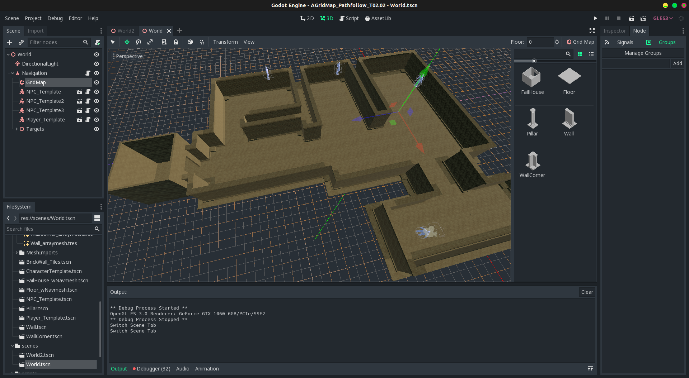
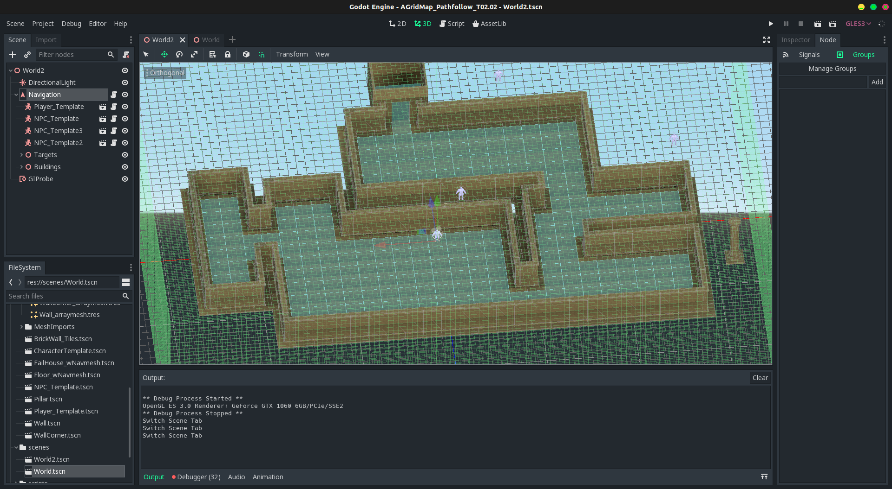

# Godot pathfollow test

My attempt to create, with [**Godot**](https://godotengine.org/) 3.x, living NPCs that can walk around the map.

## Scenes

### **World.tscn**

A GridMap based scene. The NPCs initial walking feature is working.

### **World2.tscn**

A non GridMap based scene. The NPCs initial walking feature is working.
